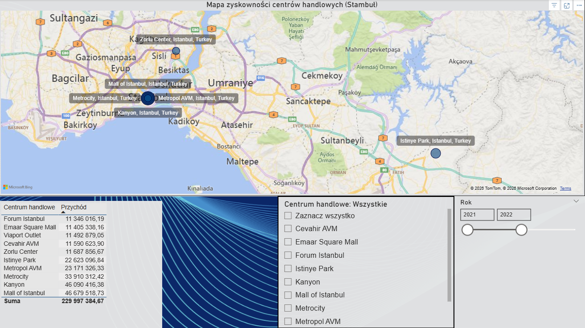
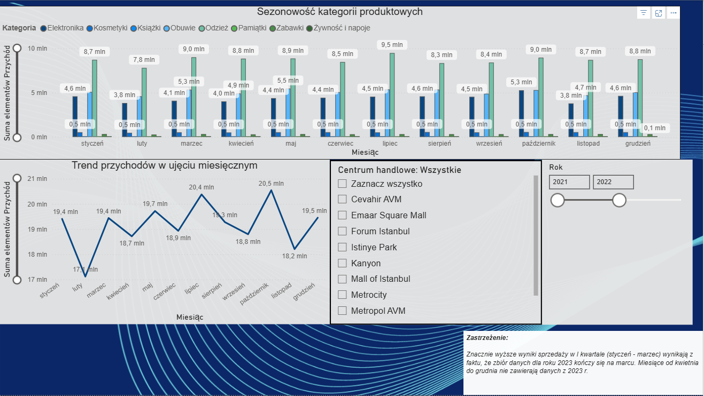
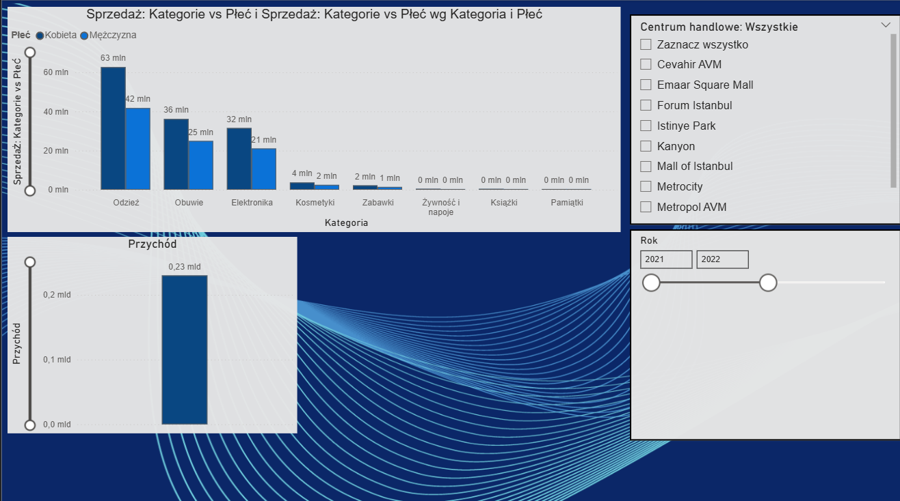
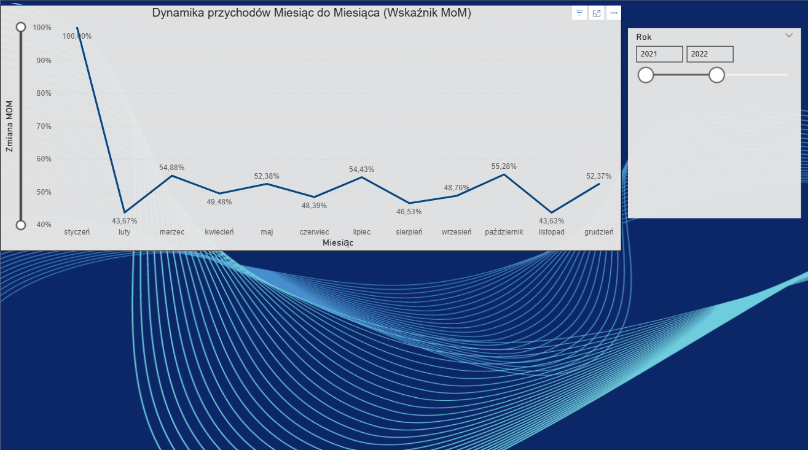
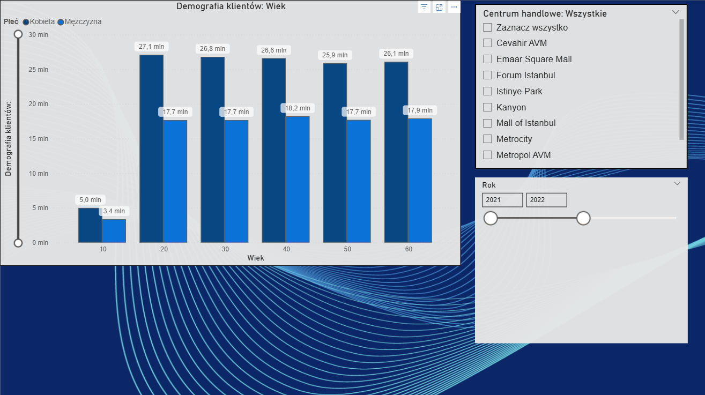

# Fashion & Retail Performance Dashboard

## Project Overview
This is a Power BI dashboard I created to analyze retail sales across different shopping mall locations. It's based on a dataset of over 99,000 transactions. The main goal of the project was to track sales trends, understand customer demographics, and check the profitability of specific locations.

What I did in this project:
 - DAX measures: Wrote custom DAX formulas (including CALCULATE and iterative functions) to calculate things like sales dynamics, seasonality, and profit margins.
 - Handling data quality issues: While working on the source files, I noticed a significant gap in the data for 2023. I implemented logic and filters to handle this missing data, ensuring the final report doesn't show skewed or misleading metrics.

Tools used: Power BI | Power Query | DAX | Data Visualization

## Dashboard Preview

## Files in this repository
* `.pbix` file - The main Power BI project containing the model and visuals.
* Source datasets used for the analysis.

